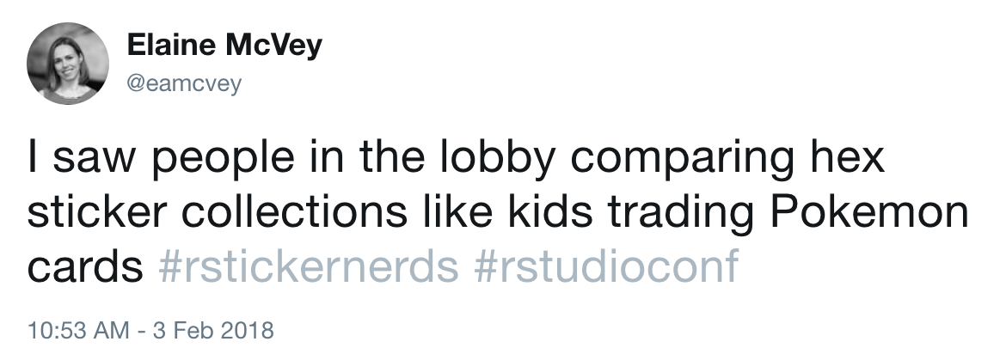
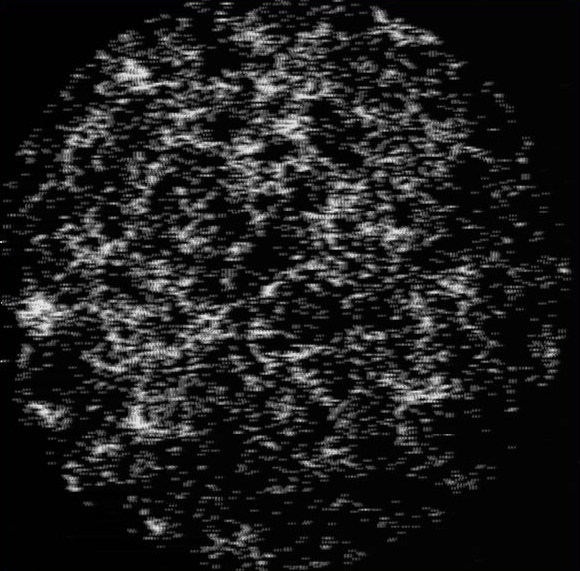
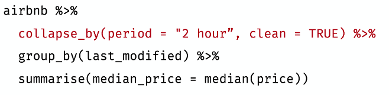

```{r include=FALSE}
library(knitr)
# make sure that we cache results and don't print code by default
opts_chunk$set(cache=TRUE, echo=FALSE, message=FALSE, warnings=FALSE, errors=FALSE)

```

# RStudio::conf

- San Diego, CA. 2-3 Feb
- *Not* an academic conference
  - Fancy hotel
  - Breakfast, lunch, and snacks provided
  - Rooftop party with open bar
  - (Do we really *need* any of that?)
  - Substantial industry presence (e.g., data scientists from Fannie Mae, CarFax, Etsy)
- Mostly (70%) men (kinda like this presentation?)
---

# People *really* like hexagonal stickers



---

# Central themes

- "tidyverse"
  - package ecosystem/cult? (more explanation in a moment)
- TensorFlow
  - fancy numerical optimisation
- `shiny`
  - make wee GUIs for yr code
- community building for open source projects

---

# okay, but what is "tidyverse"

.pull-left[


<small><a href="https://www.tidyverse.org">tidyverse.org</a></small>
]

.pull-right[
- Each variable is in a column
- Each observation is a row
- Each value is a cell

<small>from Di Cook's talk</small>
]

<br/>
<br/>
<div align="center">
<i>"statistics starts once you have tidy data"</i>
<br/>
<small>Di Cook</small>
</div>

---

background-size: contain
background-image: url('images/hipster_nonsense.jpeg')

---

class: inverse, middle, center

# Di Cook plenary

---

# Visual inference

.pull-left[
- can we determine p-values from asking humans which plots are different?
- "practical significance"
  - with large datasets, significance possible with very small effects sizes (e.g., c-section babies in Australia)
  - visual inference can help prevent meaningless significance
]

.pull-right[

]


---

# Protocols

- Lineup protocol: *"compare the data plot with null plots of samples where there really is nothing going on"*
- Rorschach protocol: *"plot a lot of null samples, to get a sense for what might be seen when there is nothing"*
- null samples by permutation or simulation

---

background-size: contain
background-image: url('images/govt_lineup.png')

---

# Not a new idea(!)

.pull-left[
- [Neyman, Scott and Shane (1953)](http://adsabs.harvard.edu/full/1953ApJ...117...92N)
]

.pull-right[

]


---

# Further info

- `nullabor` package
- Majumder et al (2013) *Validation of Visual Statistical Inference, Applied to Linear Models*, JASA
- Hofmann et al (2012) *Graphical Tests for Power Comparison of Competing Design*, InfoVis
- [Di's slides](http://www.dicook.org/files/rstudio/)

---

class: inverse, middle, center

# JJ Allaire plenary

---

# TensorFlow

.pull-left[
- high-performance library for numerical optimisation
  - tensors are arrays
  - "flow" comes from making a graph of the computation
- includes Hamiltonian Monte Carlo via automatic (algorithmic) differentiation
- lots of hype about "deep learning" **yawn**
]

.pull-right[

]

---

# What is cool about TensorFlow?

- AD!
- Compile to binary (no R needed, incl. for `shiny` apps, [`tfdeploy`](https://tensorflow.rstudio.com/tools/tfdeploy/articles/introduction.html))
- Don't have to have full model in memory
- powers [`greta`](https://greta-dev.github.io/greta/)

```{r, eval=FALSE, echo=TRUE}
library(greta)

x <- iris$Petal.Length
y <- iris$Sepal.Length

int = normal(0, 5)
coef = normal(0, 3)
sd = lognormal(0, 3)

mean <- int + coef * x
distribution(y) = normal(mean, sd)

m <- model(int, coef, sd)
```

---

background-size: contain
background-image: url('images/jj-deep.png')

---

background-size: contain
background-image: url('images/tf-core.png')

---

class: inverse, middle, center

# Shorter talks round-up

---

# Spatial data with `sf` (Edzer Pebesma)

- `sp` is a *pain*
- `sf` ("simple features") is the next gen of `sp`
- 17 "simple features", including points, lines, and polygons
- manipulation consistent with tidyverse (`sf` methods are "sticky")
  - easy conversion between units
- Dev. version of [`geom_sf()`](http://ggplot2.tidyverse.org/reference/ggsf.html) available
- [Vignettes](https://cran.r-project.org/web/packages/sf/vignettes/sf1.html)


---

# Teaching with R (Daniel Kaplan)

- Use `learnr` + [`checkr`](https://github.com/dtkaplan/checkr) + ...
- Make interactive assignments
- log what students do and *analyse*
- check and suggest hints
- (at Macalester College teaches trig with R)

<div align="center">Demo</div>

- See also: Robinson, [teach the tidyverse to beginners]( http://varianceexplained.org/r/teach-tidyverse/)

---

# Fast package development (Jim Hester)

- `devtools`, `usethis` for quick package development
- doesn't have to go on CRAN
- given how fast development can be, why not?
- [Jim's demo](https://github.com/jimhester/presentations/tree/master/2018_02_03-You-can-make-a-package-in-20-minutes)

<div align="center">Demo</div>

---

background-size: contain
background-image: url('images/pkg-who.png')

---


# Useful functions from the lesser known tidyverse (Emily Robinson, Jenny Bryan)

- `dplyr::na_if()` to convert annoying values to NAs
- `skmir::skim()` to look at summary stats for dfs/tbls
- `forcats::fct_reorder()` to reorder factors by sorting on another var
- `tibble::tribble()` for creating toy datasets
- `reprex::reprex()` for reproducible examples
- `purr::map()` for selecting elements of lists

---

# Time-series analysis (Davis Vaughan)

- Goal: time-indexed tibble compatible with tidyverse
- `tibbletime::tbl_time(df, index = Date)`
- `tibbletime::filter_time` to easily filter for date-time range

- `tibbletime::collapse_by()` to summarise records by e.g., 2-hr periods

- `tibbletime::rollify()` for rolling averages (or any other function)


---


# Further reading

- [RStudio::conf 2018](https://www.rstudio.com/conference/)
- [YouTube link for 1st day of talks](https://www.youtube.com/watch?v=ogy7rHWlsQ8)
- [YouTube link for 2nd day of talks](https://www.youtube.com/watch?v=Ol1FjFR2IMU)
- [RStudio github repo of materials](https://github.com/rstudio/rstudio-conf/tree/master/2018)
- [Links to all available slides](https://github.com/simecek/RStudioConf2018Slides)


- [switching to tidyverse guide](http://www.significantdigits.org/2017/10/switching-from-base-r-to-tidyverse/)
- [RStudio cheatsheets](https://www.rstudio.com/resources/cheatsheets/)


